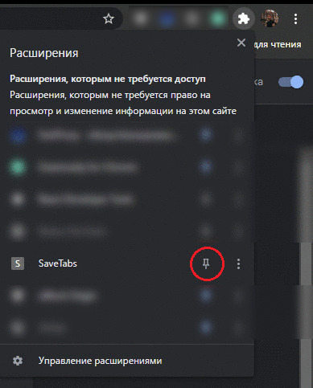

# save_tabs

## Description

Chrome extension that helps save and retrieve tabs you don't want to lose when closing the browser.
The app allows saving multiple named sets of tabs and reopen them when needed.

The extension is yet to be published to the Chrome Store but can be manually inslaled.

## Installation

1. Download content of the repository.
2. Unpack the archive.
3. Go to chrome://extensions/.
4. Switch to developer mode.
5. Press Load unpacked button and select save_tabs-master folder.
6. You can optionally pin the extension to the quick access bar as shown on screenshot below.

## Usage

To save tabs currently opened in your browser open the app and press "Save tabs" button.

Then enter a name for the set of tabs you're saving (e.g. "Course work") and press Enter on your keyboard.

Congratulations! You saved your first set of tabs.

